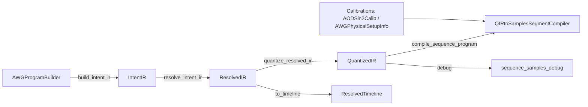

# AWG Segment Factory

A small library for building **AWG sequence-mode programs** from a fluent, stateful
builder API, then compiling them into **per-segment int16 samples** and a **sequence
step table** (e.g. for Spectrum sequence replay mode).

The design goal is to keep a clear separation between:
- **User intent** (what you asked for)
- **Compiler-friendly IR** (explicit, integer-sample primitives)
- **Hardware constraints** (segment quantisation, wrap-continuous holds, minimum sizes)
- **Samples** (what you upload to the card)

## To run

This package uses `uv` to manage dependencies. To run any of the examples:
```
uv run examples/recreate_current.py
```

Python requirement: `>=3.13` (see `pyproject.toml`).

### Restricted environments (optional)

If your environment blocks access to `~/.cache` (e.g. some sandboxes/CI), run uv with a repo-local cache:

```
uv run --cache-dir .uv-cache examples/recreate_current.py
```

`uv` manages a virtualenv in `.venv`. Install/update deps with:
```
uv sync --dev
```

To run Spectrum hardware-control examples, install the optional extra:
```
uv sync --dev --extra control-hardware
```

## Quick start

### 1) Build a program (builder → IR)

```python
import numpy as np
from awgsegmentfactory import AWGProgramBuilder

fs = 625e6

ir = (
    AWGProgramBuilder()
    .logical_channel("H")
    .logical_channel("V")
    # Uncalibrated channels interpret amps as RF amplitudes in mV.
    .define("init_H", logical_channel="H", freqs=[90e6], amps=[300.0], phases="auto")
    .define("init_V", logical_channel="V", freqs=[100e6], amps=[300.0], phases="auto")
    .segment("wait", mode="wait_trig")     # loops until trigger
        .tones("H").use_def("init_H")
        .tones("V").use_def("init_V")
        .hold(time=200e-6)
    .segment("chirp_H", mode="once")       # one-shot segment
        .tones("H").move(df=+2e6, time=50e-6, idxs=[0])
    .build_resolved_ir(sample_rate_hz=fs)
)
print(ir.duration_s, "seconds")
```

### 2) Compile to per-segment int16 samples

```python
from awgsegmentfactory import (
    AWGPhysicalSetupInfo,
    compile_sequence_program,
    quantize_resolved_ir,
)

quantized = quantize_resolved_ir(
    ir,
)
physical_setup = AWGPhysicalSetupInfo(logical_to_hardware_map={"H": 0, "V": 1})
card_max_mV = 450.0  # match your AWG channel amplitude setting

compiled = compile_sequence_program(
    quantized,
    physical_setup=physical_setup,
    full_scale_mv=card_max_mV,
    full_scale=32767,
)

print("segments:", len(compiled.segments))
print("steps:", len(compiled.steps))
```

### GPU synthesis (optional)

If you have CuPy + an NVIDIA GPU available, `compile_sequence_program(..., gpu=True)` runs the
sample-synthesis stage on the GPU (resolve/quantize are still CPU).

- `output="numpy"` (default): returns NumPy int16 buffers (GPU→CPU transfer once per segment).
- `output="cupy"`: keeps int16 buffers on the GPU (useful for future RDMA workflows).
  - To convert back to NumPy, use `compiled_sequence_slots_to_numpy(...)`.

For explicit slot control (including partial recompile/hot-swap):
- `repo = QIRtoSamplesSegmentCompiler.initialise_from_quantised(...)`
- `repo.compile()` for all segments, or `repo.compile(segment_indices=[k])` for one segment.

See `examples/benchmark_pipeline.py --gpu`.

### Phase modes (optional)

Each segment can set `phase_mode` to control how the *start phases* are chosen:

- `manual`: use the phases stored in the IR (from `.define(..., phases=[...])`, `.add_tone(phase=...)`, etc.).
- `optimise`: choose start phases to reduce crest factor based on the segment's start freqs/amps.
- `continue`: continue phases across segment boundaries for tones whose frequencies match, and optimise
  any new/unmatched tones while keeping continued tones fixed.

Notes:
- `phase_mode` is applied during `compile_sequence_program(...)` (sample synthesis). The debug
  timeline `ResolvedIR.to_timeline()` shows pre-optimised phases.
- `.define(..., phases="auto")` currently means "all zeros"; this is typically fine when using
  `phase_mode="optimise"`/`"continue"`.

### 3) Debug helpers (optional)

Debug helpers live in `awgsegmentfactory.debug` and require the `dev` dependency group
(matplotlib / ipywidgets).

- Grid/timeline debug (Jupyter): see `examples/debugging.py`
- Sample-level debug with segment boundaries (and optional 2D spot grid): see `examples/sequence_samples_debug.py`

## Hardware upload (Spectrum) (optional)

This repo includes working Spectrum examples under `examples/spcm/` (sequence mode, triggers, etc).
Install the optional dependency group first: `uv sync --extra control-hardware`

`upload_sequence_program(...)` supports CPU upload when you pass an open `spcm.Card`:

- full upload:
  - `session = upload_sequence_program(repo, mode="cpu", card=card, upload_steps=True)`
- data-only update (same segment lengths + same step graph):
  - `upload_sequence_program(repo, mode="cpu", card=card, cpu_session=session, segment_indices=[k], upload_steps=False)`

For connection/configuration flow, see `examples/spcm/6_awgsegmentfactory_sequence_upload.py`.
For one-segment data hot-swap, see `examples/spcm/6_awgsegmentfactory_segment_hotswap.py`.

## Optical-power calibration (optional)

Optical calibration is attached through `AWGPhysicalSetupInfo`.

When a hardware channel has an `AODSin2Calib`, `amps` in the IR are interpreted as
desired optical power (arb), and synthesis converts `(freq, optical_power)` to RF
amplitude before waveform generation.

### Calibration concepts

`AODSin2Calib` models a single hardware channel with:

`optical_power(freq, rf_amp_mV) ≈ g(freq) * sin^2((π/2) * rf_amp_mV / v0(freq))`

- `g(freq)`: maximum reachable optical power (arb) at each frequency.
- `v0(freq)`: RF-amplitude scale (mV) controlling where saturation occurs
  (it is a function of frequency, not a frequency itself).
- Inversion is used at compile time:
  desired optical power -> required RF amplitude.
- Behavior at limits:
  - negative optical powers are clamped to `0`.
  - requests above reachable power are clamped just below full scale of the model (`1 - y_eps` in normalized space).
  - frequencies outside calibrated bounds are evaluated using edge-clamped normalized frequency.

`AODSin2Calib` also stores:
- `freq_min_hz` and `freq_max_hz`: where data supports the fit.
- `traceability_string`: free-form provenance (filename, lab-book note, date, etc).
- derived `best_freq_hz`: frequency with highest fitted `g(freq)` within `[freq_min_hz, freq_max_hz]`.

### Calibration objects

Built-in calibration objects (`src/awgsegmentfactory/calibration.py`):

- `AODSin2Calib`
  - single-channel model + metadata.
  - serializable via `serialise` / `deserialise`.

- `AWGPhysicalSetupInfo`
  - container passed to `compile_sequence_program(..., physical_setup=...)`.
  - serializable via `serialise` / `deserialise` and `to_file` / `from_file`.
  - fields:
    - `logical_to_hardware_map: Dict[str, int]`
    - `channel_calibrations: Tuple[Optional[AODSin2Calib], ...]`
    - derived `N_ch` property
  - routes each logical channel in the IR to the correct physical-channel calibration.
  - if a channel calibration is `None`, that channel uses raw IR amplitudes as RF amplitudes.
    By convention these are RF amplitudes in mV.
  - if a channel has `AODSin2Calib`, that channel uses IR amplitudes as optical power (arb)
    and converts to RF amplitudes (mV) during synthesis.

### Voltage normalization

- `full_scale_mv` in `compile_sequence_program(...)` (and in
  `QIRtoSamplesSegmentCompiler.initialise_from_quantised(...)`) is the AWG output voltage (mV)
  that maps to `full_scale`.
- `clip` defaults to `1.0` in both APIs.
- If your card is configured to `card_max_mV`, use:
  - `full_scale_mv = card_max_mV`
- This convention works for both:
  - uncalibrated channels (IR amplitudes already represent RF mV),
  - calibrated channels (`AODSin2Calib` outputs RF mV from optical power requests).

### Practical workflow

1) Measure calibration data from your setup:
   - DE-compensation JSON (`DE_RF_calibration`),
   - `.awgde`,
   - or CSV point cloud `(freq_MHz, rf_amp_mV, power_arb)`.
2) Fit calibrations with:
   - `python -m awgsegmentfactory.tools.fit_optical_power_calibration ...`
   - pass one `--input-data-file` per hardware channel.
   - optionally set mapping with repeated `--logical-to-hardware-map`, e.g. `H=0`, `V=1`.
   - optionally set provenance with repeated `--traceability-string`.
3) Save JSON output (`--write-out`) and load as `AWGPhysicalSetupInfo.from_file(...)`.
4) Compile with calibration:
   - `compile_sequence_program(..., physical_setup=awg_physical_setup)`.

Examples:
- `examples/fit_optical_power_calibration.py` (fit and inspect generated `AODSin2Calib`/`AWGPhysicalSetupInfo`)
- `examples/sequence_samples_debug_sin2_calib.py` (fit sin² from file, compile with calibration, and debug samples)

## Compilation stages (mental model)



1) **Build (intent)** (`src/awgsegmentfactory/builder.py`)
   - `AWGProgramBuilder` records your fluent calls into an `IntentIR` (`build_intent_ir()`).
2) **Intent IR** (`src/awgsegmentfactory/intent_ir.py`)
   - `IntentIR` is continuous-time intent: logical channels/definitions/segments and ops with `time_s` in seconds.
3) **Resolve (discretize)** (`src/awgsegmentfactory/resolve.py` + `src/awgsegmentfactory/resolved_ir.py`)
   - `resolve_intent_ir(intent, sample_rate_hz=...)` converts seconds → integer `n_samples` and produces `ResolvedIR`.
4) **Quantise for hardware** (`src/awgsegmentfactory/quantize.py`)
   - `quantize_resolved_ir(resolved)` returns a `QuantizedIR`:
     a quantized `ResolvedIR` plus `SegmentQuantizationInfo`.
5) **Samples** (`src/awgsegmentfactory/synth_samples.py`)
   - `QIRtoSamplesSegmentCompiler.initialise_from_quantised(...)` creates a slot container.
   - `repo.compile(...)` compiles all segments or a contiguous subset.
   - `compile_sequence_program(...)` is a convenience wrapper for full compile.

For plotting/state queries there is also a debug view:
- `ResolvedTimeline` (`src/awgsegmentfactory/resolved_timeline.py`) and `ResolvedIR.to_timeline()`

## IR terminology

- **Intent IR**: continuous-time spec in seconds; “what you want”.
- **Resolved IR**: sample-quantized primitives (per-part integer sample counts); “what you mean”.
- **Quantized IR**: hardware-aligned segment lengths + optional wrap snapping; “what you can upload”.
- **Compiled slots**: slot container with final int16 segment buffers + step table; “what the card plays”.

## Repository guide (reading order)

1) `examples/compilation_stages.py` – end-to-end overview of the pipeline.
2) `src/awgsegmentfactory/builder.py` – fluent API and spec construction.
3) `src/awgsegmentfactory/intent_ir.py` – intent IR (ops/spec types).
4) `src/awgsegmentfactory/resolve.py` – resolver (`IntentIR` → `ResolvedIR`).
5) `src/awgsegmentfactory/resolved_ir.py` – resolved IR dataclasses and helpers.
6) `src/awgsegmentfactory/quantize.py` – quantisation (`ResolvedIR` → `QuantizedIR`) + wrap snapping.
7) `src/awgsegmentfactory/synth_samples.py` – synthesis (`QuantizedIR` → `QIRtoSamplesSegmentCompiler`).
8) `src/awgsegmentfactory/resolved_timeline.py` – debug timeline spans and interpolation.
9) `src/awgsegmentfactory/calibration.py` – calibration interfaces and built-in models.
10) `src/awgsegmentfactory/optical_power_calibration_fit.py` – fitting helpers for `AODSin2Calib`.
11) `src/awgsegmentfactory/debug/` – optional plotting helpers (Jupyter + matplotlib).

## Notes / current limitations

- `phases="auto"` currently means phases default to 0; use per-segment `phase_mode` for
  crest-optimised/continued phases during compilation.
- `OpticalPowerToRFAmpCalib` calibrations (e.g. `AODSin2Calib`) are consumed during
  `QIRtoSamplesSegmentCompiler.compile(...)` / `compile_sequence_program(...)` to convert
  `(freq, optical_power)` → RF synthesis amplitudes.

## Roadmap

See `TODO.md`.
